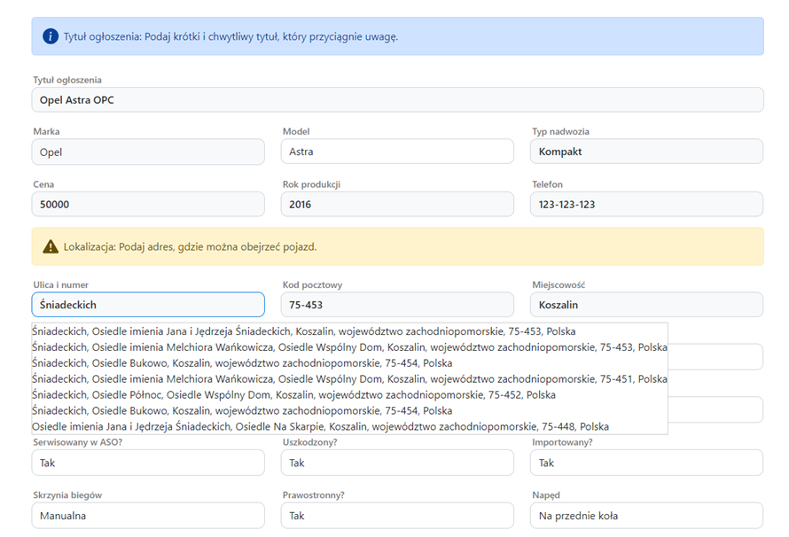

# AutoCar - Advanced Platform for Buying and Selling Cars

## Overview

**AutoCar** is a dynamic web-based platform designed to facilitate the buying and selling of cars. Initially developed as part of my engineering thesis, it has since been expanded with numerous new features to enhance the user experience in the automotive marketplace. AutoCar addresses real market needs by offering innovative solutions to users.

## Key Features

- **User Management**: 
  - Registration
    
  - Login
    
  - Profile editing
  - Password change
  - Account deletion
- **Car Listings**: 
  - Easy creation and management of car ads with detailed information
  - Photo galleries for each listing
- **Advanced Search & Filters**: 
  - Personalized search functionality with advanced filtering options
  - New sorting options for search results
    
- **Price Alerts**: 
  - Automated email notifications for price changes on selected vehicles

## New Features

- Vehicle Comparison Module: Compare multiple vehicles side-by-side

- Fuel Efficiency Rating: Evaluate and compare fuel consumption
- "For You" Module: Personalized car recommendations based on user preferences
- "Save Search" Function: Save searches for future use
- Eco Rating System: Evaluate cars based on their environmental impact
- Recently Viewed Module: Tracks recently viewed vehicles for easy reference
- Calendar Integration: Schedule meetings with sellers directly through the platform
  
- Ad Creator Function: Streamline ad creation with step-by-step guidance
- Ad Creation Progress Bar: Visualize progress when creating a car listing
- Ad Quality Rating: Helps sellers improve the quality of their ads
  
- Tagging System: Tag cars with key features for better categorization
- Notification System: Receive updates on important changes or alerts
- Auto-complete Address System: Streamlines address entry when creating listings
  
- Active and Inactive Ad Sections: Manage and track the status of car ads
  
- Advanced Search Filters: More precise search options for finding vehicles
- Detailed Vehicle Equipment Descriptions: Enhanced listings with comprehensive vehicle details
  
- Integrated Financial Tools: Insurance and loan calculators for better purchasing decisions
- Interactive Map: Displays seller locations for easier access to vehicles
- Vehicle Price Evaluation System: Helps users assess if a vehicle’s price aligns with market standards
  
- Car Value Estimator: Quick estimation of a vehicle's value based on current market data
- Share Ad: Easily share car listings with social media widgets and copied links
- Comment System: Allows users to share their experiences with specific cars or sellers
- Information About Fuel Consumption: Helps users choose fuel-efficient vehicles
  

## Why AutoCar?

AutoCar was built with the goal of innovating and improving the online automotive marketplace. By combining user feedback with modern web technologies, the platform not only meets current needs but also anticipates future market trends. AutoCar demonstrates my ability to create scalable, user-centered systems and adapt them to evolving industry demands.

I am passionate about continuous improvement, and I apply this mindset to every project I work on. AutoCar reflects my technical skills, attention to user experience, and commitment to delivering practical solutions.

---

### Technologies Used

- **Frontend**: 
  - HTML
  - CSS
  - Bootstrap 5
  - JavaScript
- **Backend**: 
  - Python/Django
- **Database**: 
  - SQLite
- **Version Control**: 
  - Git
  - GitHub
